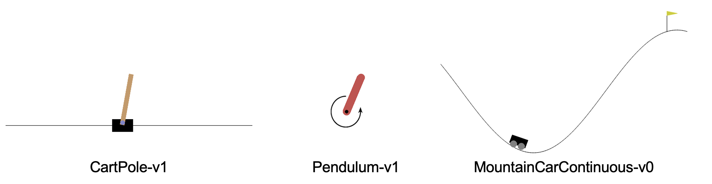
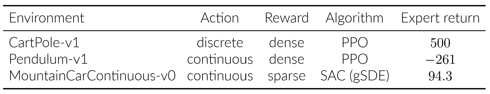
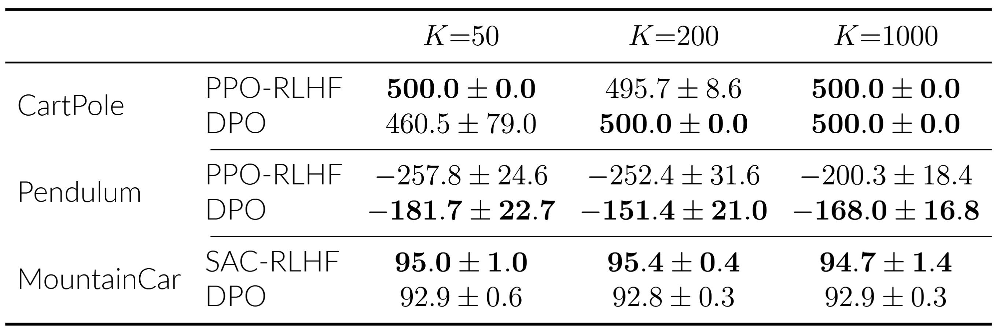
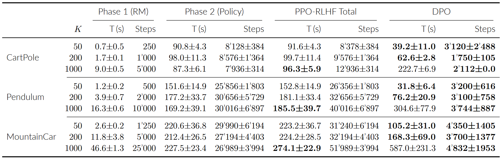

# Comparing DPO and PPO-RLHF for Reinforcement Learning from Preferences

**EE-568 Reinforcement learning — EPFL 2026**

**Authors:** João Pinto, Pedro Pinto, Tim Arni

---

## Goal

This project compares the two preference-learning algorithms **PPO-RLHF** and **Direct Preference Optimisation (DPO)** on three classical Gymnasium control environments. Both methods fine-tune a mid-performing policy using only a dataset of labelled trajectory-pair preferences. The key research question is how sample efficiency, stability and final performance scale with the number of preference pairs K ∈ {50, 200, 1000} across environments that differ in action geometry and reward density.

---

## Environments



**Figure 2. The three Gymnasium environments used in this study.**



**Table 1. Per-environment setup and expert returns.**

---

## Main Results



**Table 2. True environment return (mean ± std, 5 seeds).** Best result in each cell is bolded. On CartPole, PPO-RLHF wins at K=50, DPO wins at K=200, and both tie at K=1000. DPO outperforms PPO-RLHF on Pendulum at every K. SAC-RLHF dominates DPO on MountainCar at all K, marginally exceeding the expert return (94.3) at every dataset size. Notably, both methods surpass the Pendulum expert.



**Table 3. Computational cost.** Best result per row is bolded. Phases 1 and 2 are PPO-RLHF stages (reward model and policy training). PPO-RLHF needs 3–11× more gradient steps than DPO. DPO's sample efficiency translates to a 1.3–5× wall-clock advantage at small K; at K=1000, DPO's per-epoch cost scales with dataset size which erases this advantage and makes PPO-RLHF 1.6–2.3× faster. PPO-RLHF Phase 2, the most time-consuming phase, is not affected this way because its per-step cost is independent of K.

---

## Repository Structure

```
RL-project/
├── data_generation/   # Step 0 — train policies and generate preference datasets
├── rlhf/              # Reward model training, PPO/SAC-RLHF fine-tuning, evaluation
├── dpo/               # DPO training directly from preference pairs
├── docs/              # Submitted poster and final report
└── assets/            # Images used in this README
```

Each module is self-contained and communicates with the others only through shared data artifacts in `data_generation/outputs/`.

---

## Getting Started

**0. Set up the environment**
```bash
python -m venv .venv
source .venv/bin/activate
pip install -r requirements.txt
```

Then run the three stages in order:

**1. Generate preference data**
```bash
cd data_generation
python train_policies.py
python generate_preferences.py
```
→ See [`data_generation/README.md`](data_generation/README.md) for full details.

**2. Run PPO-RLHF**
```bash
cd rlhf
python run_efficiency_experiment.py
```
→ See [`rlhf/README.md`](rlhf/README.md) for full details.

**3. Run DPO**
```bash
cd dpo
# Open and run dpo_analysis.ipynb
```
→ See [`dpo/README.md`](dpo/README.md) for full details.