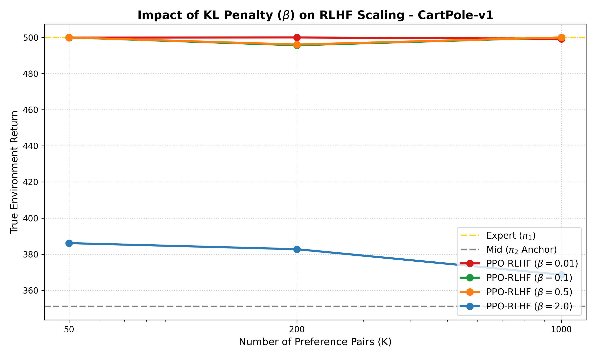
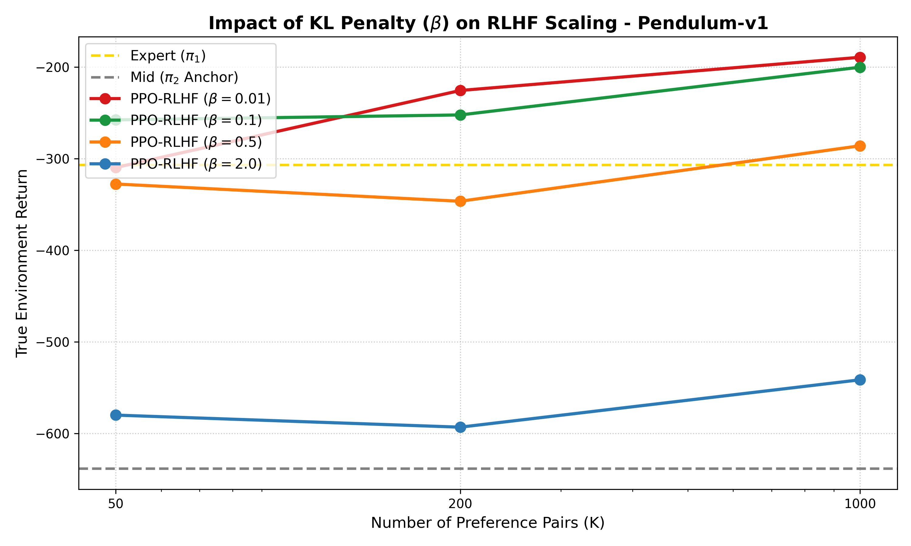
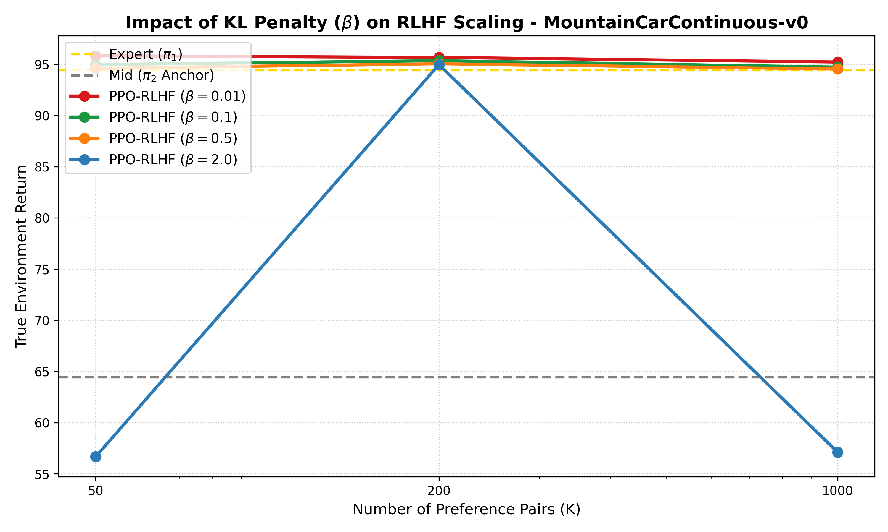

# Reinforcement Learning from Human Feedback (RLHF)

This directory contains the full PPO-RLHF pipeline: training a reward model from
synthetic preference data and using it to fine-tune a policy via RLHF.

The pipeline measures how performance and computational cost scale with the number
of preference pairs (K ∈ {50, 200, 1000}) across three environments:
CartPole-v1, Pendulum-v1, and MountainCarContinuous-v0.

## Repository Structure

```text
rlhf/
├── rm_config.py             # Per-environment reward model hyperparameters (epochs, lr)
├── config_rlhf.py           # KL penalty coefficient BETA (reads RLHF_BETA env var)
├── reward_model.py          # 2-layer MLP scoring (state, action) → scalar reward
├── rlhf_env.py              # Gym wrapper: replaces env reward with RM output + KL penalty
├── train_reward_model.py    # Phase 1: train RMs using Bradley-Terry loss
├── train_ppo_rlhf.py        # Phase 2: fine-tune policy against frozen RM (with early stopping)
├── evaluate_results.py      # Phase 3: evaluate policies, save mean/std per (env, K)
├── plot_results.py          # Phase 4: generate scaling plots from evaluation JSON
├── aggregate_efficiency.py  # Merge timing files → efficiency_results.json
├── run_efficiency_experiment.py  # Single entry point: runs all five stages in sequence
├── run_beta_ablation.py     # Sweeps BETA values (run after the main pipeline)
├── plot_beta_ablation.py    # Generates per-env ablation comparison plots
├── generate_lr_comparison_plot.py  # Diagnostic: lr=3e-4 vs lr=3e-5 convergence comparison
└── outputs/
    ├── reward_models/            # Phase 1 weights (.pth)
    ├── ppo_rlhf_results/beta*/  # Phase 2 policy checkpoints (.zip)
    ├── logs/beta*/              # TensorBoard event files
    ├── evaluation_results/beta*/ # Evaluation JSONs (mean/std)
    ├── efficiency_results/       # Timing JSONs + efficiency_results.json
    └── plots/
        ├── beta*/                # Scaling plots (.png)
        └── rm_convergence/       # Diagnostic loss curves used to tune Phase 1 (see README there)
```

## Reproducing the Experiments

The entire pipeline (45 models: 3 envs × 3 K-sizes × 5 seeds) is run with a single command:

```bash
cd rlhf
python run_efficiency_experiment.py
```

This runs the five stages below in order. Each stage must complete before the next starts.

### Stage 1 — Train Reward Models

Reads preference `.json` files from `data_generation/outputs/preferences/` and trains
one reward model per (env, K, seed) using Bradley-Terry loss with gradient clipping.
Per-environment hyperparameters (epochs, lr) are defined in `rm_config.py` and were
chosen by inspecting loss curves in `outputs/plots/rm_convergence/` (see the README there).

```bash
python train_reward_model.py
```

Outputs: `outputs/reward_models/{env}_K{K}_seed{seed}_reward_model.pth`
Timing:  `outputs/efficiency_results/rm_timing.json`

### Stage 2 — Fine-tune Policies

Loads each reward model and fine-tunes a copy of the mid-performing policy against it.
Uses SB3's `EvalCallback` + `StopTrainingOnNoModelImprovement` for early stopping:
the policy is evaluated in the raw environment every `cfg.eval_freq` timesteps; training
stops once `PLATEAU_WINDOW=12` consecutive evaluations show no improvement. The best
checkpoint (highest mean return) is saved, not the last weights.

```bash
python train_ppo_rlhf.py
```

Outputs: `outputs/ppo_rlhf_results/beta{BETA}/{env}_K{K}_seed{seed}.zip`
Timing:  `outputs/efficiency_results/ppo_timing.json`

### Stage 3 — Aggregate Timing

Merges `rm_timing.json` and `ppo_timing.json` into a single summary with mean ± std
over 5 seeds for wall-clock time (both phases) and gradient steps (Phase 2).
Phase 1 gradient steps are computed analytically (see below); Phase 2 gradient steps
are recorded at runtime because early stopping makes them variable.

```bash
python aggregate_efficiency.py
```

Output: `outputs/efficiency_results/efficiency_results.json`

### Stage 4 — Evaluate Policies

Evaluates expert baselines, mid-policy baselines, and all fine-tuned policies over
50 deterministic episodes. Saves mean and standard deviation per (env, K).

```bash
python evaluate_results.py
```

Output: `outputs/evaluation_results/beta{BETA}/evaluation_results_beta{BETA}.json`

### Stage 5 — Plot Results

Reads the evaluation JSON and generates scaling plots (true environment return vs. K
on a log scale, with ± std bands).

```bash
python plot_results.py
```

Output: `outputs/plots/beta{BETA}/{env}_scaling_plot.png`

---

## Methodology

**Independent seeds:** 5 separate reward models are trained on 5 isolated datasets per
(env, K). 5 separate policies are then fine-tuned against those specific reward models.
Final metrics are mean ± std over these 5 independent end-to-end runs.

**Starting point:** all PPO/SAC agents initialise from the mid-performing policy (not
random) to reduce variance and ensure a controlled starting point.

**KL penalty:** the RLHF environment wrapper replaces the true environment reward with
`r_hat(s, a) - BETA * KL(pi || pi_ref)`. BETA is set in `config_rlhf.py` (default 0.1)
and can be overridden via the `RLHF_BETA` environment variable.

---

## Gradient Steps

### Phase 1 — Reward Model training

Batch size is 1 (one gradient step per preference pair per epoch). Epochs are fixed
per environment (defined in `rm_config.py`):

| Environment              | epochs |
|--------------------------|--------|
| CartPole-v1              | 5      |
| Pendulum-v1              | 10     |
| MountainCarContinuous-v0 | 25     |

```text
Phase 1 grad steps = K × epochs
```

| Environment              | K=50 | K=200 | K=1000 |
|--------------------------|------|-------|--------|
| CartPole-v1              | 250  | 1,000 | 5,000  |
| Pendulum-v1              | 500  | 2,000 | 10,000 |
| MountainCarContinuous-v0 | 1,250| 5,000 | 25,000 |

### Phase 2 — Policy fine-tuning

Phase 2 grad steps are variable because early stopping terminates training as soon as
the policy plateaus. They are measured at runtime from `model.num_timesteps` and
reported in `efficiency_results.json` as mean ± std over 5 seeds.

For reference, the analytical formula for a full-budget run (no early stopping):

**PPO** (CartPole-v1, Pendulum-v1):

```text
grad steps = floor(tune_budget / n_steps) × floor(n_steps / batch_size) × n_epochs
           = floor(tune_budget / 2048) × 32 × 10
```

| Environment | tune_budget | Max grad steps (no early stop) |
|-------------|-------------|--------------------------------|
| CartPole-v1 | 100,000     | ~15,360                        |
| Pendulum-v1 | 300,000     | ~46,720                        |

**SAC** (MountainCarContinuous-v0, train_freq=32, gradient_steps=32):

```text
grad steps = floor(tune_budget / train_freq) × gradient_steps = tune_budget
```

| Environment              | tune_budget | Max grad steps (no early stop) |
|--------------------------|-------------|--------------------------------|
| MountainCarContinuous-v0 | 50,000      | ~50,000                        |

---

## Beta Ablation Study

To study how the KL penalty coefficient affects performance, run the ablation after
the main pipeline has completed (reward models in `outputs/reward_models/` are reused):

```bash
python run_beta_ablation.py
python plot_beta_ablation.py
```

Results are written to `outputs/ppo_rlhf_results/beta*/`,
`outputs/evaluation_results/beta*/`, and `outputs/plots/ablation_comparisons/`.

### Results

Mean return ± std over 5 seeds for β ∈ {0.01, 0.1, 0.5, 2.0}:

**CartPole-v1** (expert ≈ 500, mid ≈ 350)

| β    | K=50         | K=200        | K=1000       |
|------|--------------|--------------|--------------|
| 0.01 | 499.9 ± 0.2  | 500.0 ± 0.0  | 499.3 ± 1.5  |
| 0.1  | 500.0 ± 0.0  | 495.7 ± 8.6  | 500.0 ± 0.0  |
| 0.5  | 500.0 ± 0.0  | 496.1 ± 5.6  | 500.0 ± 0.0  |
| 2.0  | 386.1 ± 20.3 | 382.8 ± 42.2 | 368.6 ± 18.3 |

**Pendulum-v1** (expert ≈ −267, mid ≈ −650)

| β    | K=50           | K=200          | K=1000         |
|------|----------------|----------------|----------------|
| 0.01 | −309.8 ± 179.2 | −225.7 ± 38.4  | −189.5 ± 25.6  |
| 0.1  | −257.8 ± 24.6  | −252.4 ± 31.6  | −200.3 ± 18.4  |
| 0.5  | −327.8 ± 20.4  | −346.6 ± 74.0  | −286.1 ± 46.2  |
| 2.0  | −580.1 ± 11.1  | −593.2 ± 10.9  | −541.5 ± 31.7  |

**MountainCarContinuous-v0** (expert ≈ 94.3, mid ≈ 65)

| β    | K=50         | K=200        | K=1000       |
|------|--------------|--------------|--------------|
| 0.01 | 95.8 ± 0.4   | 95.7 ± 0.8   | 95.2 ± 0.6   |
| 0.1  | 95.0 ± 1.0   | 95.4 ± 0.4   | 94.7 ± 1.4   |
| 0.5  | 94.6 ± 1.0   | 95.1 ± 0.4   | 94.5 ± 1.2   |
| 2.0  | 56.7 ± 74.8  | 95.0 ± 0.6   | 57.1 ± 75.0  |

Scaling plots for all four β values:





### Analysis and choice of β = 0.1

**β = 2.0 — too large.** The KL penalty dominates the reward signal, preventing the
policy from meaningfully departing from the reference π₂. CartPole stalls at ~380
(well below the 500 ceiling), Pendulum improves only marginally over the mid anchor (~−580 vs. mid ~−630),
and MountainCar is catastrophically unstable (std ≈ 75): with a hard KL constraint,
whether the policy escapes the sparse-reward local optimum becomes entirely seed-dependent.

**β = 0.5 — too large for Pendulum.** While CartPole and MountainCar are largely
unaffected, Pendulum degrades steadily (−328 / −347 / −286 for K=50/200/1000, vs. expert ≈ −267). The
stronger penalty prevents the policy from optimising the continuous reward signal
efficiently.

**β = 0.01 — unstable at low data.** At K=50 on Pendulum, β=0.01 produces
std = 179.2 (vs. 24.6 for β=0.1): a 7× increase in variance. With very few
preference pairs the reward model is noisy, and a near-zero KL penalty allows
the policy to over-optimise its flaws — some seeds diverge, others converge, giving
high across-seed variance. At K=200 and K=1000 the reward model improves and
β=0.01 recovers (−225.7 and −189.5), but the instability at low data is a liability.

**β = 0.1 — best overall trade-off.** It achieves near-expert performance across
all three environments and all dataset sizes, with consistently low variance. It is
the only value that is both (a) strong enough to stabilise training when the reward
model is noisy (K=50 on Pendulum) and (b) permissive enough to let the policy
improve well beyond the mid anchor. β = 0.1 was therefore used for all full
PPO-RLHF experiments.
